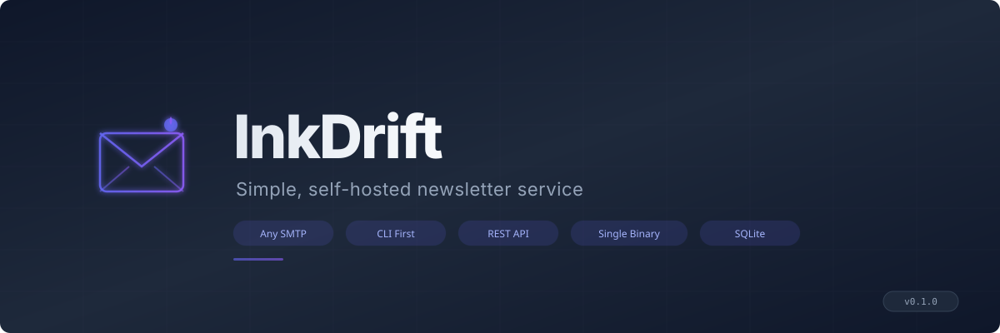

<p align="center">
  
</p>

<p align="center">
  <strong>Self-hosted newsletter service that works with any SMTP provider.</strong><br/>
  One binary. One database. Full control over your mailing list.
</p>

<p align="center">
  <a href="#quick-start">Quick Start</a> &bull;
  <a href="#website-integration">Integration</a> &bull;
  <a href="#api-reference">API</a> &bull;
  <a href="#deployment">Deployment</a> &bull;
  <a href="#configuration">Configuration</a>
</p>

---

## Why InkDrift?

Most newsletter services are SaaS platforms that charge per subscriber, lock you into their ecosystem, and own your data. InkDrift is different:

- **Bring your own SMTP** -- works with Hostinger, Hetzner, Contabo, Gmail, Outlook, Amazon SES, or any provider
- **Own your data** -- everything lives in a single SQLite file you control
- **Single binary** -- no runtime dependencies, no database servers, no message queues
- **CLI-first** -- manage everything from your terminal, script it, automate it
- **REST API** -- drop a subscribe form into any website in minutes
- **Production-ready** -- rate limiting, TLS, CORS, constant-time auth, RFC-compliant headers

## Quick Start

### Install from source

```bash
git clone https://github.com/artaeon/inkdrift.git
cd inkdrift
make build
```

### Interactive setup

```bash
./inkdrift init
```

This walks you through SMTP configuration, tests the connection, and writes `inkdrift.toml`.

### Or jump straight in

InkDrift works out of the box with sensible defaults -- no config file needed for local development.

```bash
# Create a mailing list
./inkdrift list create "Weekly Digest"

# Add subscribers
./inkdrift subscriber add reader@example.com --list "Weekly Digest"
./inkdrift subscriber import contacts.csv --list "Weekly Digest"

# Scaffold a campaign with an HTML template
./inkdrift campaign init "March Update"
# Edit campaigns/march-update/email.html with your content

# Create and preview
./inkdrift campaign create \
  --name "March Update" \
  --subject "What's new this month" \
  --body-file campaigns/march-update/email.html \
  --list "Weekly Digest"

./inkdrift campaign preview <id> --output preview.html

# Send it
./inkdrift campaign send <id>

# Start the API server for website integration
./inkdrift serve
```

## Website Integration

### Next.js / React

```tsx
"use client";
import { useState } from "react";

export function NewsletterForm() {
  const [email, setEmail] = useState("");
  const [status, setStatus] = useState<"idle" | "loading" | "success" | "error">("idle");

  const subscribe = async (e: React.FormEvent) => {
    e.preventDefault();
    setStatus("loading");
    try {
      const res = await fetch("https://newsletter.example.com/api/v1/subscribe", {
        method: "POST",
        headers: { "Content-Type": "application/json" },
        body: JSON.stringify({ email }),
      });
      setStatus(res.ok ? "success" : "error");
    } catch {
      setStatus("error");
    }
  };

  if (status === "success") return <p>Thanks for subscribing!</p>;

  return (
    <form onSubmit={subscribe}>
      <input
        type="email"
        value={email}
        onChange={(e) => setEmail(e.target.value)}
        placeholder="your@email.com"
        required
      />
      <button type="submit" disabled={status === "loading"}>
        {status === "loading" ? "..." : "Subscribe"}
      </button>
    </form>
  );
}
```

### Vanilla HTML

```html
<form id="subscribe">
  <input type="email" name="email" placeholder="your@email.com" required />
  <button type="submit">Subscribe</button>
</form>

<script>
  document.getElementById("subscribe").addEventListener("submit", async (e) => {
    e.preventDefault();
    const email = e.target.email.value;
    const res = await fetch("https://newsletter.example.com/api/v1/subscribe", {
      method: "POST",
      headers: { "Content-Type": "application/json" },
      body: JSON.stringify({ email }),
    });
    alert(res.ok ? "Subscribed!" : "Something went wrong");
  });
</script>
```

### cURL

```bash
# Subscribe
curl -X POST https://newsletter.example.com/api/v1/subscribe \
  -H "Content-Type: application/json" \
  -d '{"email": "reader@example.com", "list": "Weekly Digest"}'

# List all lists (admin)
curl https://newsletter.example.com/api/v1/lists \
  -H "X-API-Key: your-api-key"

# Get stats (admin)
curl https://newsletter.example.com/api/v1/stats \
  -H "X-API-Key: your-api-key"
```

## API Reference

### Public Endpoints

| Method | Endpoint                     | Description                          |
|--------|------------------------------|--------------------------------------|
| POST   | `/api/v1/subscribe`          | Subscribe (double opt-in if SMTP configured) |
| GET    | `/api/v1/unsubscribe?token=` | Unsubscribe via token                |
| POST   | `/api/v1/unsubscribe?token=` | Unsubscribe via token                |
| GET    | `/api/v1/confirm?token=`     | Confirm subscription (double opt-in) |

### Admin Endpoints

Require `X-API-Key` header or `Authorization: Bearer <key>`.

| Method | Endpoint                                   | Description              |
|--------|--------------------------------------------|--------------------------|
| GET    | `/api/v1/lists`                            | List all mailing lists   |
| POST   | `/api/v1/lists`                            | Create a new list        |
| GET    | `/api/v1/lists/{id}/subscribers`           | List subscribers (paginated) |
| GET    | `/api/v1/lists/{id}/subscribers/search?q=` | Search subscribers       |
| GET    | `/api/v1/campaigns`                        | List all campaigns       |
| GET    | `/api/v1/stats`                            | Aggregate statistics     |
| GET    | `/health`                                  | Health check (no auth)   |

#### Subscribe Request Body

```json
{
  "email": "user@example.com",
  "name": "Optional Name",
  "list": "List Name"
}
```

#### Pagination

Subscriber list supports `?limit=100&offset=0` (max 1000 per page).

## CLI Reference

```
inkdrift init                                      Interactive setup wizard
inkdrift serve                                     Start API server
inkdrift version                                   Print version
inkdrift stats                                     Show dashboard statistics
inkdrift test-smtp user@example.com                Test SMTP configuration
inkdrift check-dns example.com                     Check SPF/DKIM/DMARC/MX records
inkdrift backup create                             Backup database
inkdrift backup ls                                 List backups
inkdrift backup restore <file>                     Restore from backup

inkdrift list create "Name"                        Create a mailing list
inkdrift list ls                                   List all lists
inkdrift list delete <id>                          Delete a list

inkdrift subscriber add email@example.com          Add a subscriber
inkdrift subscriber ls --list "Name"               List subscribers
inkdrift subscriber search "query" --list "Name"   Search by email/name
inkdrift subscriber import contacts.csv            Import from CSV (email,name)
inkdrift subscriber export -o subscribers.csv      Export to CSV
inkdrift subscriber remove email@example.com       Unsubscribe

inkdrift campaign init "Campaign Name"             Scaffold campaign directory
inkdrift campaign create --name "..." --list "..."   Create a campaign
inkdrift campaign ls                               List all campaigns
inkdrift campaign preview <id>                     Preview rendered HTML
inkdrift campaign test-send <id> email@example.com Send test to one address
inkdrift campaign update <id> --body-file new.html Update campaign body
inkdrift campaign duplicate <id>                   Duplicate as new draft
inkdrift campaign send <id>                        Send to all subscribers
inkdrift campaign send <id> --dry-run              Preview without sending
inkdrift campaign delete <id>                      Delete a campaign

inkdrift template create "name" -f template.html   Create email template
inkdrift template ls                               List templates
```

## Double Opt-In

When SMTP and domain are configured, InkDrift automatically enables double opt-in:

1. User submits their email via the subscribe API
2. InkDrift creates the subscriber with `pending` status
3. A confirmation email is sent with a unique link
4. User clicks the link, subscriber becomes `active`
5. Only `active` subscribers receive campaign emails

This satisfies CAN-SPAM and GDPR consent requirements. When SMTP is not configured (e.g., local development or CLI-only usage), subscribers are created as `active` immediately.

## SMTP Providers

InkDrift works with any standard SMTP provider. Here are common configurations:

| Provider      | Host                    | Port | Notes                          |
|---------------|-------------------------|------|--------------------------------|
| Hostinger     | `smtp.hostinger.com`    | 465  | TLS                            |
| Hetzner       | `mail.your-server.de`   | 587  | STARTTLS                       |
| Contabo       | `mail.contabo.de`       | 587  | STARTTLS                       |
| Gmail         | `smtp.gmail.com`        | 587  | Requires app password          |
| Outlook       | `smtp-mail.outlook.com` | 587  | STARTTLS                       |
| Amazon SES    | `email-smtp.region.amazonaws.com` | 587 | IAM credentials         |
| Mailgun       | `smtp.mailgun.org`      | 587  | STARTTLS                       |
| SendGrid      | `smtp.sendgrid.net`     | 587  | API key as password            |

### Email Deliverability

InkDrift follows email best practices out of the box:

- **RFC 5322 compliant headers** -- Message-ID, Date, Return-Path, Precedence
- **Multipart emails** -- HTML + auto-generated plaintext for every message
- **List-Unsubscribe header** -- one-click unsubscribe for Gmail, Apple Mail, etc.
- **MX validation** -- verifies recipient domains before accepting subscriptions
- **DNS checker** -- `inkdrift check-dns` verifies your SPF, DKIM, DMARC, and MX records

For best deliverability, configure these DNS records for your sending domain:

```
# SPF - authorize your mail server
TXT  @  "v=spf1 include:_spf.your-provider.com -all"

# DKIM - sign outgoing mail (provider-specific)
TXT  default._domainkey  "v=DKIM1; k=rsa; p=..."

# DMARC - policy for failed checks
TXT  _dmarc  "v=DMARC1; p=quarantine; rua=mailto:dmarc@example.com"
```

## Configuration

### Config File

InkDrift looks for configuration in this order:

1. `./inkdrift.toml` (current directory)
2. `~/.config/inkdrift/config.toml`
3. `/etc/inkdrift/config.toml`

```toml
[server]
name = "My Newsletter"
domain = "newsletter.example.com"

[smtp]
host = "smtp.hostinger.com"
port = 465
username = "newsletter@example.com"
password = "your-password"
from = "newsletter@example.com"
from_name = "My Newsletter"
tls = true

[api]
host = "0.0.0.0"
port = 3377
api_key = "your-secret-api-key"
cors = "https://example.com"
rate_limit = 30

[db]
path = "inkdrift.db"
```

### Environment Variables

Every config value can be overridden with environment variables. This is the recommended approach for production and Docker deployments.

| Variable                  | Description                     | Default           |
|---------------------------|---------------------------------|-------------------|
| `INKDRIFT_SMTP_HOST`      | SMTP server hostname            |                   |
| `INKDRIFT_SMTP_PORT`      | SMTP server port                | `587`             |
| `INKDRIFT_SMTP_USERNAME`  | SMTP authentication username    |                   |
| `INKDRIFT_SMTP_PASSWORD`  | SMTP authentication password    |                   |
| `INKDRIFT_SMTP_FROM`      | Sender email address            |                   |
| `INKDRIFT_SMTP_FROM_NAME` | Sender display name             |                   |
| `INKDRIFT_SMTP_TLS`       | Enable TLS (`true`/`false`)     | `true`            |
| `INKDRIFT_API_KEY`        | Admin API authentication key    |                   |
| `INKDRIFT_API_PORT`       | API server port                 | `3377`            |
| `INKDRIFT_API_HOST`       | API server bind address         | `0.0.0.0`         |
| `INKDRIFT_CORS`           | CORS allowed origin             | `*`               |
| `INKDRIFT_RATE_LIMIT`     | Requests per minute per IP      | `30`              |
| `INKDRIFT_DOMAIN`         | Public domain for links         |                   |
| `INKDRIFT_NAME`           | Newsletter name                 | `InkDrift Newsletter` |
| `INKDRIFT_DB_PATH`        | SQLite database file path       | `inkdrift.db`     |

## Deployment

### Docker

```bash
docker build -t inkdrift .
docker run -d \
  -p 3377:3377 \
  -v inkdrift-data:/data \
  -e INKDRIFT_SMTP_HOST=smtp.hostinger.com \
  -e INKDRIFT_SMTP_USERNAME=newsletter@example.com \
  -e INKDRIFT_SMTP_PASSWORD=your-password \
  -e INKDRIFT_SMTP_FROM=newsletter@example.com \
  -e INKDRIFT_API_KEY=your-secret-key \
  -e INKDRIFT_DOMAIN=newsletter.example.com \
  inkdrift
```

### Docker Compose

```bash
docker compose up -d
```

The included `docker-compose.yml` has Traefik labels for automatic HTTPS.

### FleetDeck

InkDrift ships with a `.fleetdeck.toml` for one-command deployment:

```bash
fleetdeck deploy . --domain newsletter.example.com

# Configure SMTP via environment
fleetdeck env set inkdrift INKDRIFT_SMTP_HOST=smtp.hostinger.com
fleetdeck env set inkdrift INKDRIFT_SMTP_USERNAME=newsletter@example.com
fleetdeck env set inkdrift INKDRIFT_SMTP_PASSWORD=your-password
fleetdeck env set inkdrift INKDRIFT_SMTP_FROM=newsletter@example.com
fleetdeck env set inkdrift INKDRIFT_API_KEY=your-secret-key
```

### Systemd

```ini
[Unit]
Description=InkDrift Newsletter Service
After=network.target

[Service]
Type=simple
ExecStart=/usr/local/bin/inkdrift serve
WorkingDirectory=/opt/inkdrift
Restart=always
RestartSec=5
Environment=INKDRIFT_DB_PATH=/opt/inkdrift/data/inkdrift.db

[Install]
WantedBy=multi-user.target
```

## Security

- **Double opt-in** confirms subscriber consent (CAN-SPAM / GDPR compliant)
- **Constant-time API key comparison** prevents timing attacks
- **Rate limiting** on all public and admin endpoints (configurable per IP)
- **Request body limits** prevent memory exhaustion (1KB subscribe, 4KB list creation)
- **Campaign body limits** 1MB max body, 998 char max subject (RFC 5322)
- **SMTP header injection prevention** strips CR/LF from all header values
- **Database file permissions** set to 0600 (owner read/write only)
- **SQLite single-writer mode** prevents database corruption under concurrency
- **HTTP server timeouts** prevent slowloris and connection exhaustion
- **Graceful shutdown** drains connections on SIGTERM/SIGINT
- **Input validation** on all endpoints (email format, length limits, domain MX verification with timeout)
- **Admin endpoints locked** when no API key is configured (returns 403, not open)
- **Bounce detection** marks permanently failed addresses to protect sender reputation
- **Atomic campaign sends** prevent double-send race conditions
- **Request logging** for all API endpoints (method, path, status, duration, IP)

## Architecture

```
inkdrift
├── cmd/                    CLI commands (Cobra)
├── internal/
│   ├── api/                REST API server + middleware
│   ├── campaign/           Campaign sending engine
│   ├── config/             Configuration loading
│   ├── db/                 SQLite database layer
│   ├── render/             Template rendering
│   └── smtp/               SMTP client (TLS/STARTTLS)
├── templates/              Built-in email templates
├── examples/               Integration examples
├── inkdrift.example.toml   Example configuration
├── Dockerfile              Multi-stage Docker build
├── docker-compose.yml      Docker Compose with Traefik
├── .fleetdeck.toml         FleetDeck deployment config
└── Makefile                Build targets
```

## Development

```bash
# Build
make build

# Run tests
make test

# Race condition detection
make test-race

# Lint
make lint

# Run locally
make run
```

## License

MIT

---

<p align="center">
  Built with Go, SQLite, and a healthy dislike for subscription fees.
</p>
